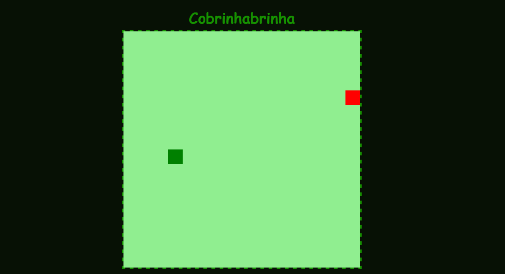

# Cobrinhabrinha
Uma projeto de réplica do jogo snake para navegadores. Base do jogo ensinada pela professora Gabriela Pinheiro.

<!-- Futuramente o jogo estará no link: 
jogodacobrinha.tk -->

Para testar a versão ao vivo, [clique aqui.](https://cursos-e-estudos.github.io/jogodacobrinha/)
 

<b> Visual desktop </b>

  

 

---
<!-- 
 

<b> Visual mobile </b>

  &nbsp; &nbsp; &nbsp; &nbsp; &nbsp; &nbsp; &nbsp; &nbsp;
  

 -->

 

 [@SouVitorGabriel](https://github.com/souvitorgabriel) Outros projetos pessoais podem ser vistos no meu perfil.